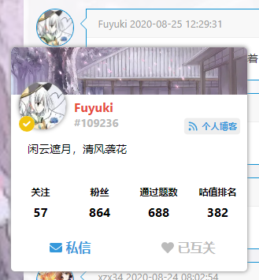
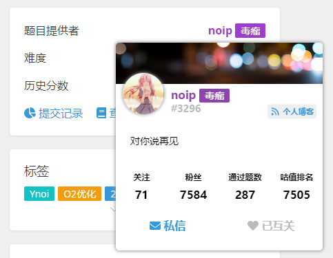

# Floating Luogu

中文 | [English](./docs/README_en.md)

一个为洛谷添加用户卡片的油猴脚本。

## 使用方法

请到 [Release 页面](https://github.com/Nikaidou-Shinku/Luogu-usercard/releases)下载最新的 `flg.user.js` 文件，然后将里面的内容复制进油猴即可。

以及 Floating Luogu 用户群 885149235 欢迎来玩~
