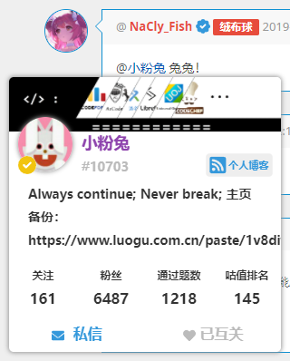
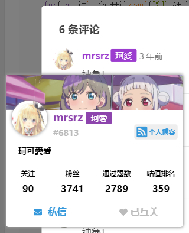
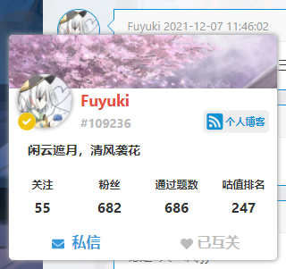

# 洛谷用户卡片

[English](../README.md) | 中文

一个为洛谷添加用户卡片的油猴脚本。

在讨论区……

在题解评论区……

在博客评论区……

甚至在题目页面！

## 食用方法

请到 [Release 页面](https://github.com/Nikaidou-Shinku/Luogu-usercard/releases)下载最新的 `Full.user.js` 文件，然后将里面的内容复制进油猴即可。
